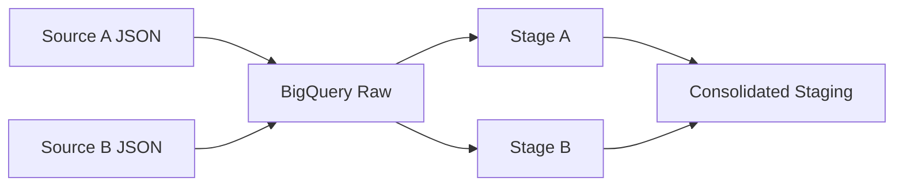
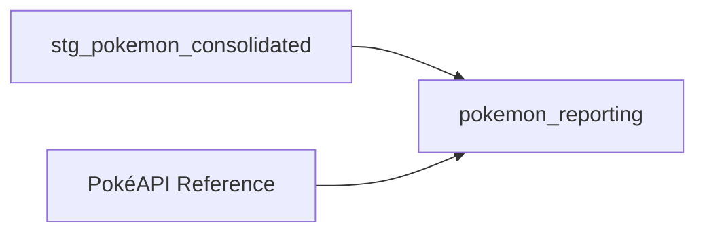

# Pokémon Data Challenge

A small data pipeline built with **Python, BigQuery and dbt**.

Two JSON sources are loaded raw, standardized into a common schema, validated, and consolidated.

## Pipeline



Python handles ingestion. dbt handles transformation, validation and modeling.

## Data exploration

I profiled both sources before building the models.

They contain the same attributes but use different field names and some different data types. The staging models standardize these differences.

| Source A | Source B | Standardized |
|---|---|---|
| `id` | `pokemonId` | `pokemon_id` |
| `name` | `pokemonName` | `pokemon_name` |
| `type_1` | `primaryType` | `primary_type` |
| `type_2` | `secondaryType` | `secondary_type` |
| `legendary` STRING | `isLegendary` BOOLEAN | `is_legendary` BOOL |

Profiling: `analyses/profile_raw_json_types.sql`

Data quality checks: `analyses/data_quality_checks.sql`

Checks include:
- row counts and source overlap
- duplicate consistency
- stat totals
- basic range checks
- multiple names under the same `pokemon_id`

## Consolidation

The sources are standardized separately and combined into `stg_pokemon_consolidated`.

I use `(pokemon_id, pokemon_name)` as the consolidation key. Overlapping rows are only deduplicated after checking that their attributes match.

`seen_in_source_a` and `seen_in_source_b` are kept for lineage.

## Assumptions & trade-offs

- `pokemon_id` alone is not unique.
- `(pokemon_id, pokemon_name)` is the consolidation key.
- Overlapping rows are validated before deduplication.
- Missing `secondary_type` stays `NULL`.
- Raw data stays unchanged; standardization happens in dbt.

## Tests

dbt tests validate:
- required fields are not null
- `(pokemon_id, pokemon_name)` is unique after consolidation

At this point, the requested staging layer is complete.

---

## Optional reporting layer

I added `pokemon_reporting` as a small downstream model to make the consolidated data easier to use for analysis.



### Naming

While exploring the consolidated data, I found names such as:

```text id="xekqce"
CharizardMega Charizard Y
DeoxysAttack Forme
PumpkabooSmall Size
```

The naming pattern was not reliable enough to separate the Pokémon name from the variant in every case.

For the reporting layer, I added a minimal PokéAPI reference containing only `pokemon_id` and species name.

```text id="w5gn0e"
Charizard | Mega Charizard Y
Deoxys    | Attack Forme
Pumpkaboo | Small Size
```

No external stats or attributes are used. The challenge datasets remain the source of truth.

For a more complete model, Pokémon species and varieties could be modeled separately using the API. I kept the reference minimal to avoid adding unnecessary scope to the challenge.

### Final model

`pokemon_reporting` has one row per Pokémon variant.

| pokemon_id | pokemon_name | pokemon_form | variant_count |
|---:|---|---|---:|
| 6 | Charizard | Default | 3 |
| 6 | Charizard | Mega Charizard X | 3 |
| 6 | Charizard | Mega Charizard Y | 3 |
| 386 | Deoxys | Attack Forme | 4 |

The reporting layer also has its own tests:
- required fields are not null
- `(pokemon_id, pokemon_form)` is unique

## Running the project

```bash id="r3fbq4"
python -m venv .venv
source .venv/bin/activate
pip install -r requirements.txt

gcloud auth application-default login
gcloud config set project pokemon-data-challenge

python data_pokemon/scripts/load_raw_data.py
python data_pokemon/scripts/fetch_pokemon_reference.py

cd dbt_pokemon
dbt debug
dbt build
```

BigQuery datasets should use the **EU** location.

## Project structure

```text id="w09z8e"
pokemon-data-challenge/
├── data_pokemon/
│   ├── data/
│   │   └── reference/
│   │       └── pokemon_reference.json
│   ├── raw/
│   │   ├── pokemon_source_a.json
│   │   └── pokemon_source_b.json
│   └── scripts/
│       ├── load_raw_data.py
│       └── fetch_pokemon_reference.py
│
├── dbt_pokemon/
│   ├── analyses/
│   │   ├── profile_raw_json_types.sql
│   │   └── data_quality_checks.sql
│   │
│   ├── models/
│   │   ├── _sources.yml
│   │   │
│   │   ├── staging/
│   │   │   ├── _staging.yml
│   │   │   ├── stg_pokemon_source_a.sql
│   │   │   ├── stg_pokemon_source_b.sql
│   │   │   └── stg_pokemon_consolidated.sql
│   │   │
│   │   └── reporting/
│   │       ├── _reporting.yml
│   │       └── pokemon_reporting.sql
│   │
│   ├── tests/
│   │   ├── unique_consolidated_pokemon.sql
│   │   └── unique_reporting_pokemon_form.sql
│   │
│   └── dbt_project.yml
│
├── requirements.txt
└── README.md
```

A quick map:

- `data_pokemon/` — ingestion and external reference
- `analyses/` — profiling and exploratory data quality checks
- `staging/` — source standardization and consolidation
- `reporting/` — optional analytics-ready model
- `tests/` — custom dbt data tests

### Stack & sources

| | |
|---|---|
| **Data sources** | Source A JSON, Source B JSON |
| **Reference** | PokéAPI — Pokémon ID and species name only |
| **Ingestion** | Python |
| **Warehouse** | Google BigQuery |
| **Transformation** | dbt Core |
| **Validation** | dbt tests + SQL data quality checks |

## AI usage

I used AI as a pair-programming and debugging assistant during the project, mainly to discuss implementation alternatives, review SQL/dbt syntax, and troubleshoot errors.

I validated the suggestions against the actual data and BigQuery outputs. The grain, consolidation approach, data quality checks, and final modeling decisions were based on what I found while profiling and exploring the datasets.